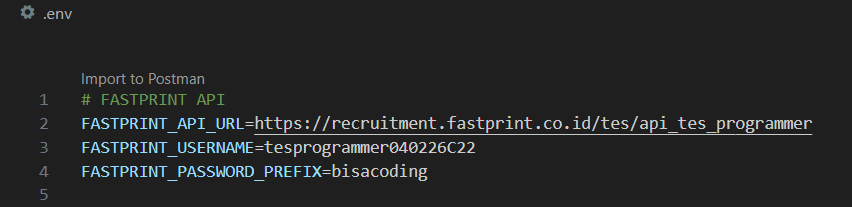
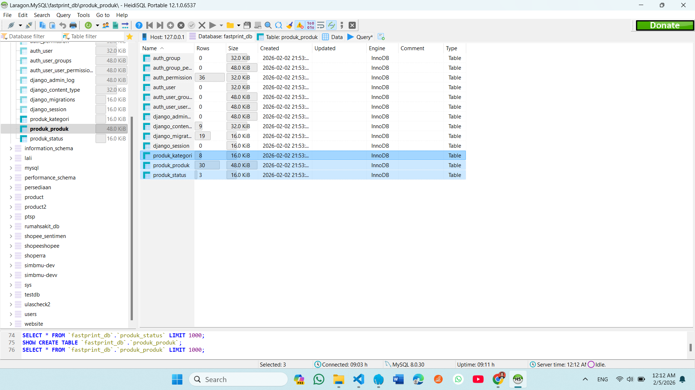
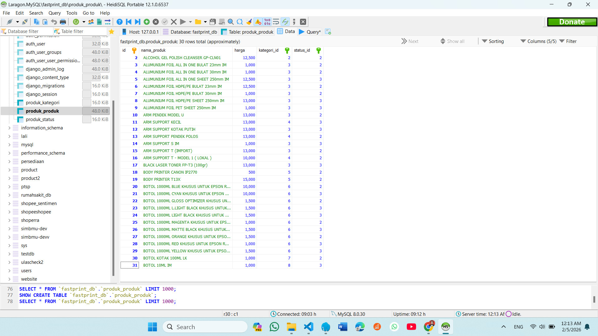
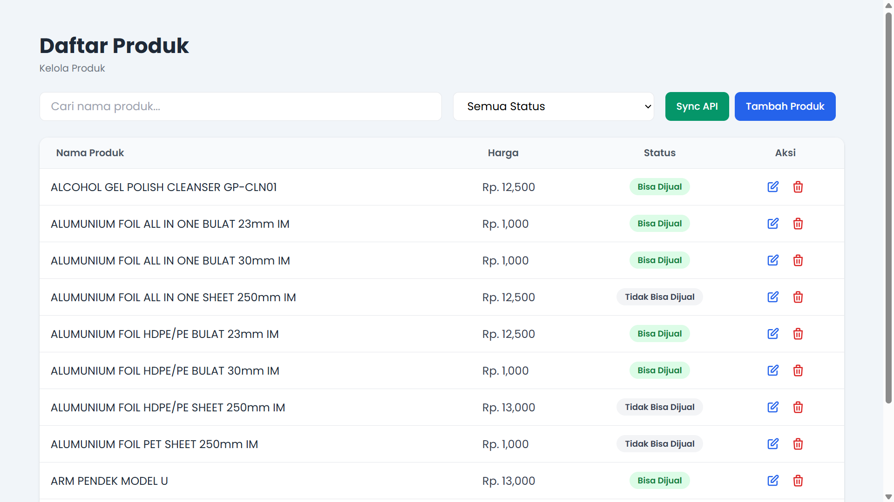
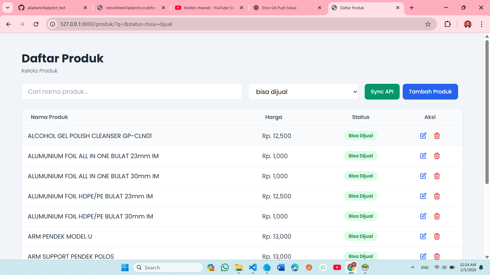
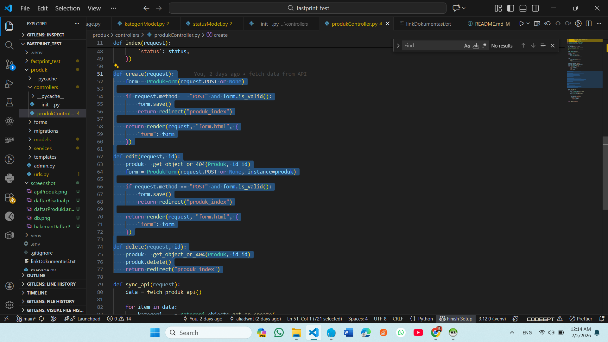
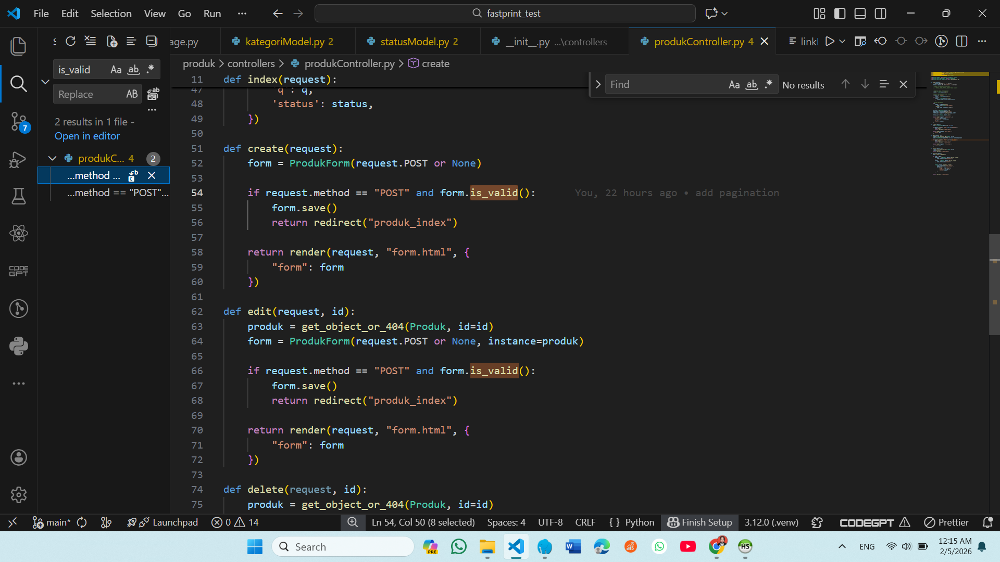
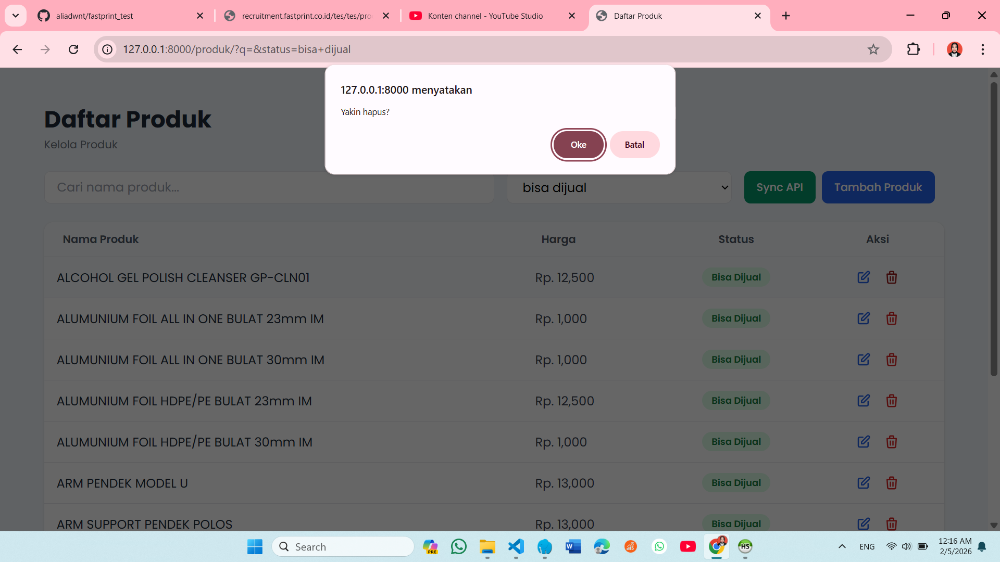

# Test Junior Programmer – FastPrint

Project ini dibuat untuk memenuhi **Tes Junior Programmer FastPrint** menggunakan **Django**.

Aplikasi mengambil data produk dari API FastPrint, menyimpannya ke database, dan menampilkannya dalam bentuk tabel dengan fitur CRUD.

---

## Fitur

- Ambil data produk dari API FastPrint
- Simpan data ke database
- Tampilkan data produk
- Filter produk berdasarkan status
- Pencarian produk
- Tambah, edit, dan hapus produk
- Validasi form (nama wajib, harga angka)
- Konfirmasi saat hapus data

---

## Teknologi

- Python
- Django
- SQLite
- Tailwind CSS

---

## Cara Menjalankan

```bash
python -m venv env
env\Scripts\activate
pip install -r requirements.txt
python manage.py migrate
python manage.py runserver
```
buka di browser:
http://127.0.0.1:8000/

---

## Dokumentasi Foto
Tes Junior Programmer

1. Ambil data dari API yang sudah disediakan


2. Buat Database dengan table :
* Produk; id_produk, nama_produk, harga, kategori_id, dan status_id 
* Kategori; id_kategori dan nama_kategori 
* Status; id_status dan nama_status


3. Simpan produk yang sudah anda dapatkan dari url produk


4. Buat halaman untuk menampilkan data yang sudah anda simpan


5. Lalu tampilkan data yang hanya memiliki status "bisa dijual"


6. Buat fitur untuk edit, tambah dan hapus


7. Untuk fitur tambah dan edit gunakan form validasi (inputan nama harus diisi, dan harga harus berupa inputan angka)


8. Untuk fitur hapus beri alert/konfirmasi(confirm) ketika di klik hapus


## Dokumentasi Video
Youtube: https://youtu.be/i4O1iQ9efFM